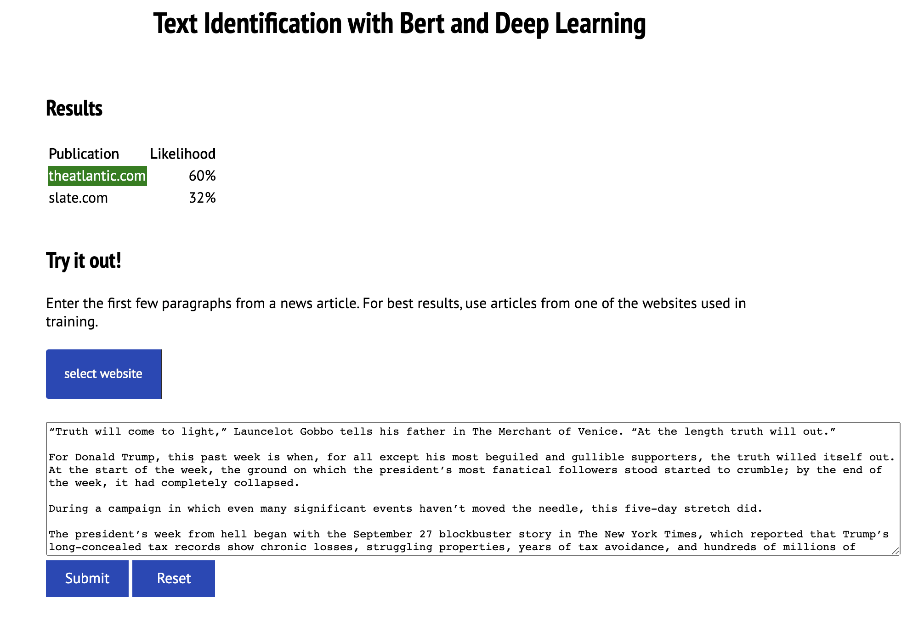

# Document Classification Using a Fine-Tuned BERT Model

## Goal
For my capstone project, I created a system to handle the full lifecycle for 
training and serving a model that attempts to determine the source of a news
or opinion article from the web based only on the text of the article.  

## Process
For training data, I crawled several news and opinion websites using an open-source
crawling tool named [News Please](https://github.com/fhamborg/news-please).  The crawled data was loaded into Spark, where I
performed several analyses on the data so that I could determine how to clean and wrangle
the data for my project.   Some websites were eliminated at this stage because crawling
returned a very small number of articles.  I also discovered
that the returned articles would vary for some sites based on the user agent, so I refined
the crawling process to take this into account.  You can see some of my analysis in the
[Jupyter notebooks](https://github.com/metacreek/springboard/tree/master/data-wrangling) in the
data-wrangling folder of this project.

Websites vary in how they identify themselves in the content.  In some news articles, the name of 
the publication, website links, and other identifying information was in the body of articles, while on 
other websites, none of this was present.  I did not want my project to be too easy or trivial, so
I removed obvious identifying information from news articles.  This included the publication name and website.
For some websites, a much more extensive list of identifying phrases were removed.  I determined what to remove
based on thorough analysis of the data which included running a named-entity recognition model 
against the data to see common identifying phrases.

Stop words were also removed from the content, as it seemed to help with the final model.

#### BERT
In recent years, new models have been developed to greatly improve the capabilities of computers to perform natural
language processing (NLP).  One of these models, known 
as [BERT](https://ai.googleblog.com/2018/11/open-sourcing-bert-state-of-art-pre.html), was released by Google in 2018.  BERT stands
for Bidirectional Encoder Representations from Transformers.  In general, NLP techniques require turning words into
numbers that can used inside a neural network.  Many models attempt to predict
what the next word will be based on the preceding words.  BERT attempts to predict
the word based on the words before **and after** a given word, which is why it is called bidirectional.

What makes BERT so powerful is that even though it was trained on a large quantity of general purpose text, we can
fine tune it to use it on a particular use case.   For my capstone, I add a trainable layer at the end of the BERT model.
This additional layer is used to train against the news articles I collected, and it is set up to predict
the source of the news articles based on the body text.   This makes the computational effort to achieve this
task much less than it would be if we started from scratch.   The general purpose nature of the BERT model means
it can be used for other NLP problems like topic modeling or sentiment analysis by applying a different fine-tuning layer
with training.

The BERT model contains a tokenizer which converts words into numbers based on a complex set of rules.   This tokenizer
is used in my wrangling code to convert the text for the news articles into numbers.  Note that only the first 256 tokens for
a news article are used in the modeling.

The tokenized data is fed into my model, which contains the BERT model, plus the extra layer for fine tuning
for my data set.   There are many different versions of the BERT model with various sizes available for
particular use cases.  I made use of the BERT-Base model, which consists of a 12 hidden layers with 768 nodes. 

To this, I added my extra layer.   The extra layer consists of three parts:
* a dropout layer with dropout rate set to 20 percent.  The dropout layer zeros out the results from randomly selected
nodes.  This is done to add some randomness to the model so that it will generalize better to data it has never seen.  Without this,
the model could become overly fitted to the data used in training, causing it to perform worse
 on data it has never seen.  
* a dense
layer with 1024 nodes.  This layer is where the bulk of the fine-tuning is captured during training; the BERT layers are frozen and
are not adjusted as part of training.   This makes the training much faster than trying to train the entire model.  
* a "softmax" output layer that has nodes corresponding to each of the websites used in training.  The 
softmax layer causes the sum of the outputs of all nodes to equal 1.  This lets us treat each node output as the percentage
likelihood that a given news article came from the corresponding website.

## Deployment

Data collection was run as a Python program on an Amazon EC2 instance, with results stored on S3.  (I have since converted
the data collection code to run inside a Docker container for greater portability.)  

The rest of the architecture runs on Google Cloud.  I would not normally architect a system to be split
between two clouds without a good reason.  In this case, I found that many of the tools I needed were easier to
use on Google Cloud than on AWS.  For example, PySpark was easier to run and debug using Google Dataproc than using AWS 
EMR.  I also had a large free credit on GCP which covered a lot of my project costs.  I decided to leave
the system as a two-cloud system to show that I am comfortable on both platforms.

Data cleanup, wrangling, and feature preparation including tokenization is run using PySpark via Google Dataproc. As 
this step involves the most custom calculations, it also includes the most test coverage.

Modeling is run on an instance of Google Compute that has TensorFlow 2 installed.  The model is defined using the Keras 
interface to TensorFlow.  The model instance made use
of a NVidia GPU to reduce the running time required.

The resulting model is deployed to the Google Prediction service.  Unlike most other aspects of the system,
no custom code is needed to invoke the model.

I created a user interface using Flask that calls the API and presents prediction results when given the text of a news 
article.  This all runs as part of a serverless Google Cloud Function.

<blockquote>
Tokenization and the User Interface

It is necessary to pre-process and tokenize user input in the same way that article data was before modeling.  The
BERT tokenization routine is part of the TensorFlow 2 library.  However, there simply was not enough memory to bundle
TensorFlow with the Google Cloud Function that serves the user interface.  I ended up making a copy
of the tokenization code from the [Github repository](https://github.com/google-research/bert) of TensorFlow.  This code had a single dependency on the rest
of the TensorFlow library: it used a file helper to read a file from disk.  I replaced this code with
standard Python file reading.
</blockquote>

There are some time-consuming operations that must be performed when the prediction UI is invoked for the first time 
in a while.  In a true production system, some sort of pooling mechanism would be used to make sure this initialization 
has already been performed before an end-user uses the system.   However, that would involve
costs I do not wish to incur for my demonstration system.   Therefore, the UI will sometimes
time out and fail the first time it is used in a while.  In such situations, the prediction request can be
resubmitted on the page to return results quickly.

The data wrangling, modeling, and UI deployment and execution is all managed using Google Clould Composer, a hosted
version [Apache Airflow](https://airflow.apache.org/).     Google Composer will use the version of the User Interface code that is tagged with
the `production-api` github tag.  This allows for the UI version to be managed separately from other repository versions.
Throughout the lifecycle, Google buckets are used to store artifacts and results.

## Results

Initially, I had approximately 1.5 million articles from 47 different news and opinion websites. Typically with machine
learning, you split the data into three sets.   The test data set is not used at all in training the model.  After the 
model is tuned, the test data is used to get an unbiased estimate of how well the model performs on data it
has not seen before.   

The remaining data is further split into two data, the training data and the validation data.  The training data set is 
what is used to train the model.  The validation data is used similarly to test data to get an idea on
how the model performs on data it hasn't seen.  However, the training and validation set is reselected for each epoch of
model training, so any given data set might be used in training in at least one epoch.  This lets us
get an idea of how well the model performs on new data while still using that additional data to fine tune
the model.  The validation set is also used to tune hyperparameters that can improve model performance.
Because of these reasons, the validation data is not truly independent of the model training, and so
we cannot use it to get an idea of how the model performs on new data.

I set aside 20 percent of my data for testing.  During training, the remaining data was split 80/20 into test and training data to provide 
an idea of the accuracy of the model.  

To evaluate the model, I used accuracy.  The output of the model is a distribution
of likelihoods that a given text came from a publication.  A result is considered accurate only if the most likely 
predicted publication matches the actual publication.  After 3 epochs of model training, the training accuracy was 66.4 percent
and the validation accuracy was 69.9 percent.   If we were to predict the website by random, we would expect an accuracy 
 of only 2.1%, so the model is remarkably effective at prediction.  When the model was applied on the 20 percent of data
that was not used during training, the accuracy of the predictions was 69.8 percent.  This demonstrates that the model 
generalizes to data it has not seen quite well.   You can follow this first attempt at modeling in 
[this Jupyter notebook](https://github.com/metacreek/springboard/blob/master/modeling/notebooks/training.ipynb).

There was a wide variation in the number of articles used per website based on what was returned from the crawling. I had
over 110,000 articles for two websites, but less than 500 for one website and less than 1000 for three websites.  This 
variation in size of data for each prediction class is known as class imbalance and is known to
cause problems for models, so I refined my data set to include only websites where I had at least 20,000 articles.  For 
websites with more than 20,000 articles, I included only the 20,000 that was most recent so that I would
have an equal number of articles for each prediction class.  This reduced the number of websites to 17.  If we were 
to guess randomly, we would expect a prediction accuracy of 5.9 percent.

For the second modeling attempt, the code was converted from a notebook into a Python program.  Once again, I held out 20 percent of the data to use in estimating the accuracy of the model on
data it had never seen.   After 7 epochs of training on the new data, the
model produced an accuracy of 72.7 percent on the training data, and 78.8 percent on the internal validation
accuracy.  When used to make predictions on the data held out from training, the model was
79.3 accurate.  This again shows that the model generalizes well to data it has not seen. It also shows 
that having balanced classes can improve the accuracy somewhat.   This model is the version
that is deployed for use with the UI.  

The accuracy on the held out data for each website used in the model is shown below:

| 	Website	 | 	Accuracy	 |
| 	----------------------	 | 	-----------------:	 |
| 	axios.com	 | 	89.0 %	 |
| 	breitbart.com	 | 	65.2 %	 |
| 	chicago.suntimes.com	 | 	75.2 %	 |
| 	chicagotribune.com	 | 	100.0 %	 |
| 	foreignpolicy.com	 | 	76.9 %	 |
| 	foxnews.com	 | 	70.2 %	 |
| 	ft.com	 | 	87.6 %	 |
| 	nbcnews.com	 | 	95.0 %	 |
| 	newsday.com	 | 	87.7 %	 |
| 	newsmax.com	 | 	66.5 %	 |
| 	reuters.com	 | 	92.5 %	 |
| 	seattletimes.com	 | 	92.9 %	 |
| 	slate.com	 | 	71.8 %	 |
| 	theatlantic.com	 | 	53.8 %	 |
| 	theblaze.com	 | 	72.9 %	 |
| 	thehill.com	 | 	86.0 %	 |
| 	vox.com	 | 	64.2 %	 |
| 	washingtonexaminer.com	 | 	79.9 %	 |

## Demonstration

A screenshot of the user interface:

You can try out the prediction user interface [here](https://us-east1-topic-sentiment-269614.cloudfunctions.net/analyze-ui).  
As noted above, if you are the first user to use it in a long while, the first submission may fail, but if you
repeat it, it should work.

The user interface with present up to three guesses for the publication source, along with a percentage
of likelihood that the document came from the given publication.  Publications with a less than 10 percent
likelihood of being the source are not shown.

## Future directions

I did some mild experiments with the dropout rate used in the model, along
with the number of additional hidden layers and their sizes before settling on
the final model I used.  These could be explored further as ways of improving the accuracy.
The number of tokens used in training (256) could also be adjusted up and down.  It would also
be interesting to broaden the measure of accuracy to consider the top three predicted publications, or
perhaps some other way of taking the reported likelihood into account.

I have a hunch that the freshness of the training data will affect the model accuracy, as it seems
to perform less well with current news articles than it did back when the training data was fresh.  This should
also be explored and it can be determined how often the training should be repeated.