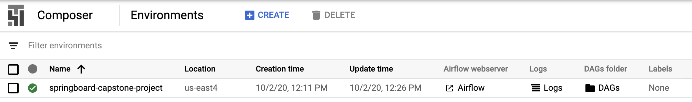
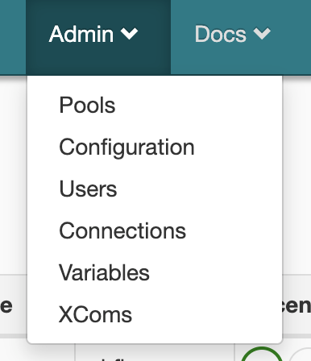
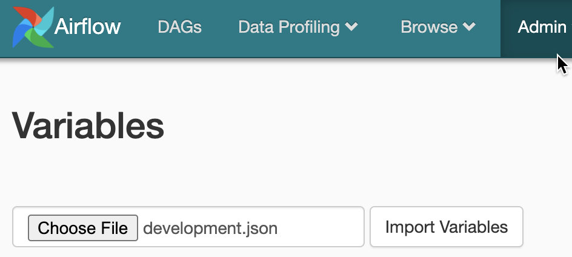
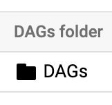
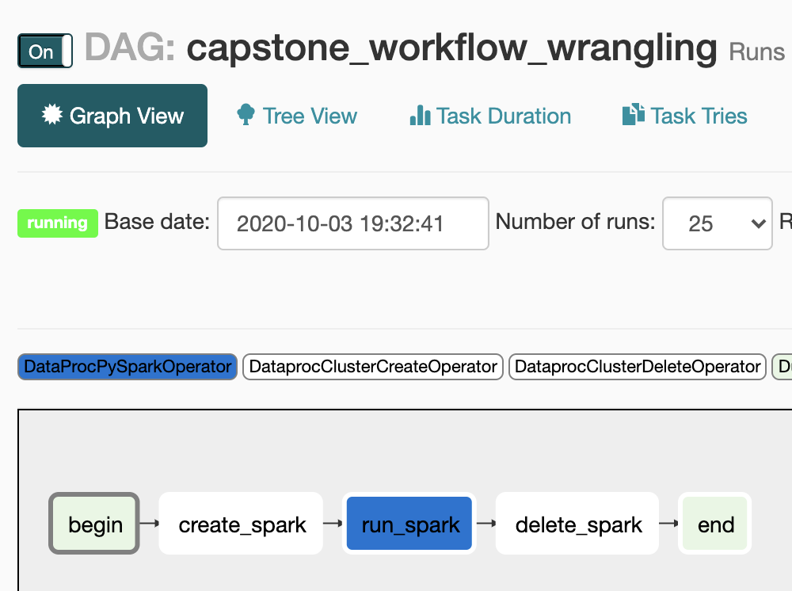
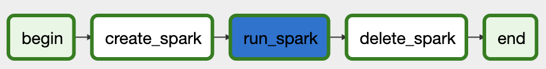

# Google Composer / Apache Airflow

Google Composer, a hosted version of Apache Airflow manages the lifecycle of most of the processes that make up this project.

### Creating the Composer environment

1\. Go to https://console.cloud.google.com/composer

2\. Click the CREATE button.

3\. Enter the following configuration info:

* Name: springboard-capstone-project
* Location: us-east4
* Zone: us-east4-c
* Image version: composer-1.12.1-airflow-1.10.9
* Python version: 3

All other fields can be left blank or with default values.

4\. Click the CREATE button.

This will begin setting up the Airflow system.  This will take approximately 15 minutes to complete.  Once it is complete you can move on to the next section.

## Setting up Airflow

Once the environment is complete you should see something like this:

### Configure Airflow variables

1\. Under Airflow webserver, click the Airflow link.   This will open up the Airflow interface in a new browser tab.

2\. On the Airflow tab, click the Admin top menu item and select Variables

3\. Click the Choose File button and navigate to the airflow directory of this repository.   You can choose either 
'development.json' for a small dataset version of this project, or 'production.json' for the full final version of 
this project.

4\. Click the Import Variables button.  After this loads you will see a list of configuration variables.

5\. Click on the Airflow logo to take you back to the default Airflow screen.

### Load Airflow DAGs

1\. Go to the Composer Environment tab: https://console.cloud.google.com/composer/environments

2\. Click the DAGs link under the DAGs folder column.  This will open a Buckets page in a new tab.

3\. On the Bucket Details tab, click the Upload Files button.  Upload the files in the airflow/dags folder of this project.

4\. It may take five minutes or so for Airflow to see the new files.  Go to the Airflow tab and refresh the screen until the
'capstone_workflow_wrangling' and 'capstone_workflow_deploy' DAGs appear in the list.

## Wrangling workflow

The workflow 'capstone_workflow_wrangling' does data cleaning and wrangling.  It also tokenizes the data to prepare it for use in modeling. 
This DAG provisions a Spark environment, rungs the cleaning and wrangling functions, and then shuts down Spark.

Normally, this would be run on some schedule, but for the purposes of this project you will trigger it manually by clicking the first button
in the links column of the Airflow DAGs page.

You can then monitor the running of execution of the steps by clicking on the name
of this DAG 'capstone_workflow_wrangling'.  I recommend clicking on the
Graph View tab to see the execution of the steps.

As each step completes, its boundary will turn dark green.  When all processes are complete it will look like this:

Click the Airflow logo to return to the main Airflow screen.

You should next perform the modeling steps listed [here](TBD).

## Model Deployment

After the modeling step is complete, the model needs to be deployed to the Google Prediction Service.  The Google Cloud
Function which serves the user interface for the project may also need to be updated. The 'capstone_workflow_deploy' workflow
performs these tasks.

To run this workflow, go to the Airflow tab and click the Airflow logo to get to the main screen if necessary.  Click the 
first button in the Links column on the capstone_workflow_deploy row.  The
execution of the workflow can be monitored similarly to what was done with the wrangling workflow.

## Environment cleanup

Once the deploy workflow is done, the Composer environment can be deleted.  To do this,
go to the Composer environment tab and click the check box next tot the springboard-capstone-project environment.  Then click the Delete
button near the top middle of the tab.